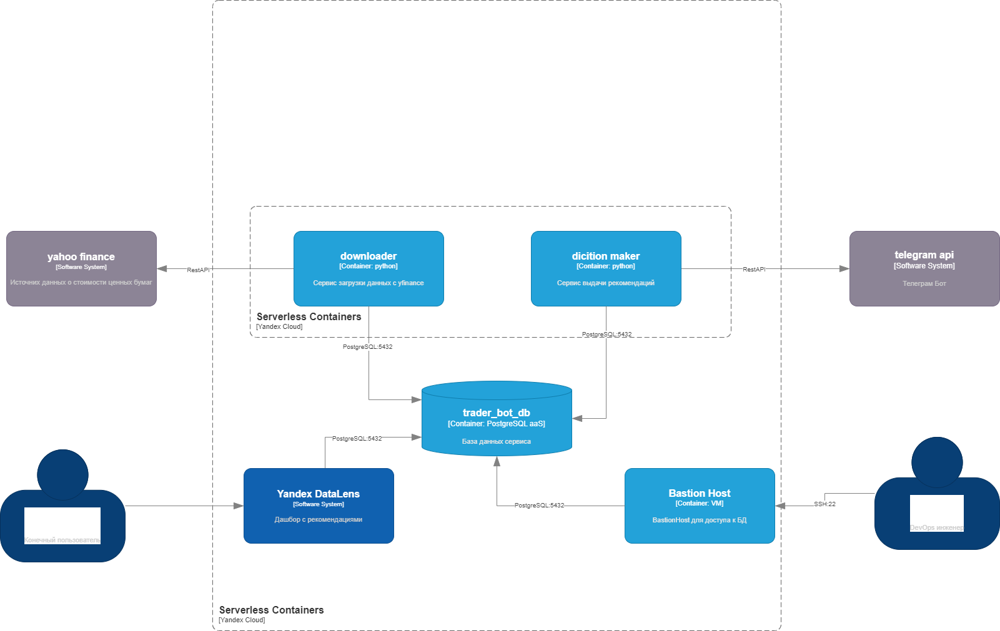

# 📘 Отчет по домашенй работе

**Тема:** Перенос модели в облачную среду
**Цель работы:** познакомиться с основными принципами переноса моделей машинного обучения в облачную среду;
рассмотреть, как развертывать и масштабировать модели в облаке;
изучить методы мониторинга и управления моделями в облачной среде.

**Исходный код**: https://github.com/WWTLF/trader_bot/tree/cloud

---

## 1. Описание архитектуры

На диаграмме представлена архитектура облачного приложения, развёрнутого в **Yandex Cloud**, предназначенного для:
- загрузки рыночных данных,
- генерации торговых рекомендаций,
- визуализации и автоматической рассылки рекомендаций пользователям.

### Компоненты системы:

- **Yahoo Finance [Software System]**  
  Внешний источник данных о финансовых инструментах. Предоставляет REST API для получения информации о ценах.

- **downloader [Container: python]**  
  Микросервис, загружающий данные с Yahoo Finance и записывающий их в базу данных.

- **diction maker [Container: python]**  
  Сервис, анализирующий данные из базы и генерирующий торговые рекомендации.

- **telegram api [Software System]**  
  Внешний API для взаимодействия с Telegram. Используется для рассылки рекомендаций пользователям через Telegram-бота.

- **trader_bot_db [Container: PostgreSQL aS]**  
  Централизованное хранилище, содержащее как исходные данные, так и рекомендации.

- **Yandex DataLens [Software System]**  
  Средство визуализации данных. Предоставляет пользователю доступ к дашбордам.

- **Bastion Host [Container: VM]**  
  Используется DevOps-инженером для безопасного доступа к базе данных по SSH.

---

## 2. Потоки данных

1. **Сбор данных:**
   - `downloader` обращается к Yahoo Finance через REST API.
   - Полученные данные сохраняются в `trader_bot_db`.

2. **Анализ и рекомендации:**
   - `diction maker` получает данные из базы, анализирует и формирует рекомендации.
   - Результаты отправляются:
     - в Telegram через `telegram api`,
     - в базу данных для последующего анализа и визуализации.

3. **Визуализация:**
   - `Yandex DataLens` подключается к базе и отображает рекомендации для пользователей. https://datalens.yandex/z8onwbafbzh6l

4. **Инфраструктурный доступ:**
   - `DevOps-инженер` использует `Bastion Host` для доступа к БД по SSH (порт 22).

---

## 3. Особенности архитектуры

- **Серверлесс-архитектура:** Используются облачные контейнеры без постоянной инфраструктуры.
- **Интеграция с мессенджером:** Автоматическая отправка рекомендаций пользователям через Telegram.
- **Безопасность:** Ограниченный доступ к базе данных только через bastion-хост.
- **Гибкость и масштабируемость:** Все компоненты можно масштабировать независимо.

---

## 4. Выводы

Модифицированная архитектура отражает современные подходы к построению распределенных облачных решений с омниканальной выдачей результатов. Включение Telegram-бота расширяет каналы взаимодействия с пользователями, что повышает удобство и актуальность уведомлений.

### Полученные навыки:
- Построение микросервисной архитектуры на базе облачных технологий,
- Использование внешних REST API и интеграция с Telegram Bot API,
- Настройка каналов визуализации через Yandex DataLens,
- Безопасный доступ к инфраструктуре через bastion-хост.

---
